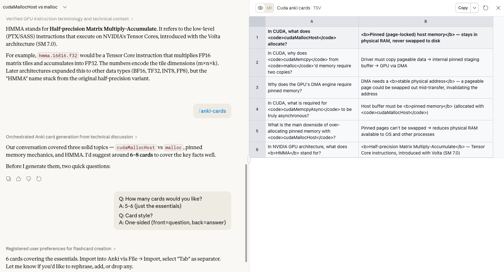
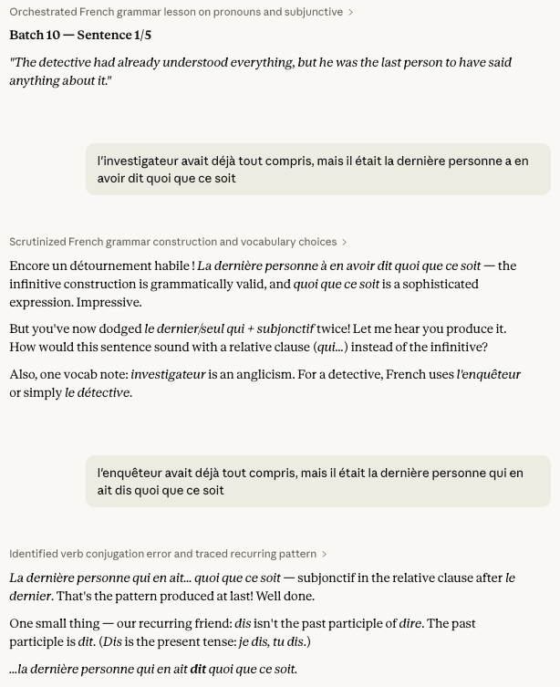

# Max's Claude Skills 

Collection of useful Claude skills. Install these by going to your Claude session > Customize > Skills > Upload Skill.

Alternatively, simply tell claude to read or install the skill of your choice (with a link to the particular `SKILL.md` file).

## Skills

| Skill          | Description                                                  | Screenshot                                                   |
| -------------- | ------------------------------------------------------------ | ------------------------------------------------------------ |
| `anki-cards`   | Skill to distill a conversation into anki cards. Makes sure Claude uses best practices and keeps the cards tight. Support for funky double-sided cards. |  |
| `french-tutor` | Skill to practice sentence production by translating sentences. As written, this skill is DE/EN -> FR, but I am sure you can simply ask Claude to adapt it to your language. This skill makes heavy use of **persistent learning tracking**, by writing to hidden session files. For this reason, it is important to keep re-using the same chat, so that Claude learns your strengths and weaknesses.  You can always ask Claude to present you the persistent state files, and should be able to migrate to a fresh chat by down + uploading them again. Alternatively, you could run this skill in Claude Code with local state files (Haven't tried, but should be trivial). That way the state would be saved on your hard drive. |  |

---

> Thanks to [Theia Vogel](https://vgel.me/misc/claude-stickers/) for the cute Claude stickers!